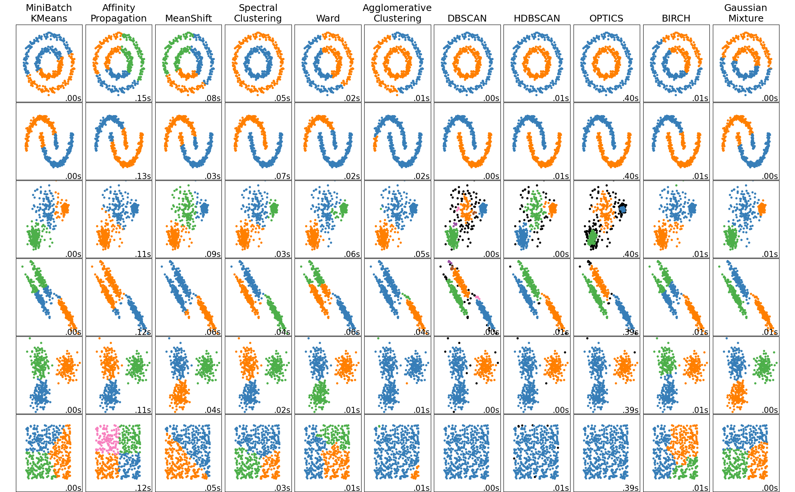

# Unsupervised Sea Ice Classification

This repository is an example of how off-shelf unsupervised machine learning algorithms can be trained to classify sea ice and leads (fractures in the sea ice where the ocean beneath is exposed). The notebook sea-ice-classification.ipynb contains the code used to read data and run the algorithms.

## Table of contents
1. [Before you begin](#before-you-begin)
2. [Some words on unsupervised learning](#some-words-on-unsupervised-learning)
3. [Results and concluding remarks](#results-and-concluding-remarks)
4. [Acknowledgements](#acknowledgements)

## Before you begin 

### Environment
This project should be run in a Python environment. The project was developt with Python 3.9, yet other versions might work. Make sure required packages are installed in your environment. This is easiest done by running

<code>pip install -r requirements.txt</code>

from the command line, standing in the main directory of this repository.

### Data
The data used in this project is not in the repository, in order to avoid pushing large files. Before you start, download the [S2A_IMG_DATA here](https://www.dropbox.com/scl/fo/ximrgbg56chuxbfzadcin/ABgmx6RvBRjtXFl3b6oUzLo?rlkey=k8re2gklruduc67hdd1aual6f&st=7kpcpyrv&dl=0) and the [S3A_DATA here](https://www.dropbox.com/scl/fo/cv0upe7f5bdasrt2pt42q/ANaMJpFd47M56W6atgVtbVY?rlkey=x7ndag4v38a1ule2lok1ba655&st=ol5wtg1l&dl=0). 

## Some words on unsupervised learning 
Clustering is a field wthin unsupervised classification. Classification means assigning groups/classes to datapoints and unsupervised means that no key/true class is used when training the model. This means that the model has no information about how a class is definied, but aims to identify similarities points in the dataset and distinguish between groups of different similarities. Unsupervised learning can me useful in explorative work where the truth is undefined or in absence of labeled data (meaning data which have been assigned a true class).

### K-Means
The K-Means algorithm divides the inputed data into k clusters. Initially, k cluster centers are selected randomly. Thereafter the following steps are iterated:
1. Assign each data point to the center that is closest to the data point.
2. For each cluster, take the average of the data points assaigned to the cluster and define the mean to be the updated cluster center.
These two steps are repeated until convergence, meaning that no data points change cluster. 

This notebook implements the K-Means algorithm from Sklearn (scipy) and more extensive information about the algorithm and optional parameters kan be found [here](https://scikit-learn.org/stable/modules/generated/sklearn.cluster.KMeans.html).

### Gaussian Mixture Models (GMMs)
The foundation of GMMs is imilar to the K-Means algorithm, but instead of simply optimizing the mean of clusters, a GMM optimizes a gaussian distribution of each cluster. This means that each cluster has a gaussian distribution with parameters optimized for the particular cluster. Thus, each data point is assigned a probability of belonging to each cluster.

The gaussian distributions allows a bit more flexibility to the forms of the clusters, compared to the euclidean distance used in K-Means, yet is still bound to somewhat spherical/elipsoid shapes. This charecteristic makes GMMs to be relatively similar to K-Means, compared to other unsupervised classification algorithms such as DBSCAN and spectral clustering. The image bellow shows how different unsupervised classification algorithms perform with different datasets (the image is taken from [Sklearn](https://scikit-learn.org/stable/auto_examples/cluster/plot_cluster_comparison.html#sphx-glr-auto-examples-cluster-plot-cluster-comparison-py)).

## Running the notebook 
After you have downloaded the data and installed the required packages, described in [Before you begin](#Before-you-begin), you open sea-ice-classification.ipynb in you favourite editor, for instance Visual Studio Code and run all cells with the Python environment in which you installed the packages. Note that running the Gaussian mixture model (GMM) may take some time. If you are in a hurry, you might want to decrease the `max_iter`. 

The main parts of the notebook are corresponds to the outline of the notebook, and are:
1. Import packages
2. Read and preprocess data
   1. Satallite images
   2. Echo-radar data
3. Cluster (classify unsupervised) data
   1. Classify satallite images with K-Means
   2. Classify satallite images with GMM
   3. Classify echo-radar data with GMM
4. Evaluation

This notebook explores the K-Means algorithm and Gaussian Mixture Models (GMMs). Although the aim is to identify sea ice and leads (2 classes), this notebook explores clustering with more than two clusters. This is of intresting because it might be easier for the model to, for instance, identify four classes which of three represent lead, than identify exactly one sea ice cluster and one lead cluster.

## Results and concluding remarks 

### K-Means classification of satallite images
#### Only Band 9

#### Combined bands

### GMM classification of satallite images
#### Only Band 9

#### Combined bands

### GMM classification of echo-radar

The mountains in the upper right courner of the images clearly inhibited the performance of the clustering algorithms. Both GMM and K-Means managed to distinguish leads from sea ice when the number of clusters were set to 4 or 5 (one of the clusters was "used" for the awkard left triangle of the images, so it should in fact be considered 3 or 4 clusters). It is likely that 3 (2) clusters would have been sufficient if there were no mountains in the image (and if the image was complete).

Clustering complitations of bands did not seem to improve the results from just using band 9, yet this is hard to asses without true labels.

For GMM clustering of altimetry data, it seems like using three cluster performed worse than two clusters. For GMM clustering of altimetry data, it seems like using three cluster performed worse than two clusters. This is supported by the cluster distributions visualized by scatter plots. The GMM clustering with two clusters was both accurate (99%) and precise (99% for leads and 100% for sea ice).

## Acknowledgements 
This project is part of a module, GEOL0069: Artificial Intelligence For Earth Observation. The major parts of the code as well as the data used is taken from [here](https://cpomucl.github.io/GEOL0069-AI4EO/Chapter1_Unsupervised_Learning_Methods_2.html), developed by Michel Tsamados, Connor Nelson and Weibin Chen. 